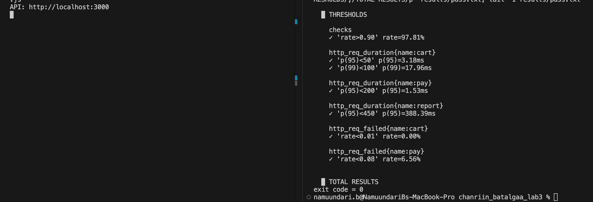
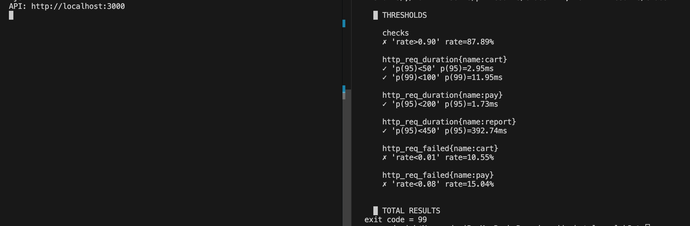
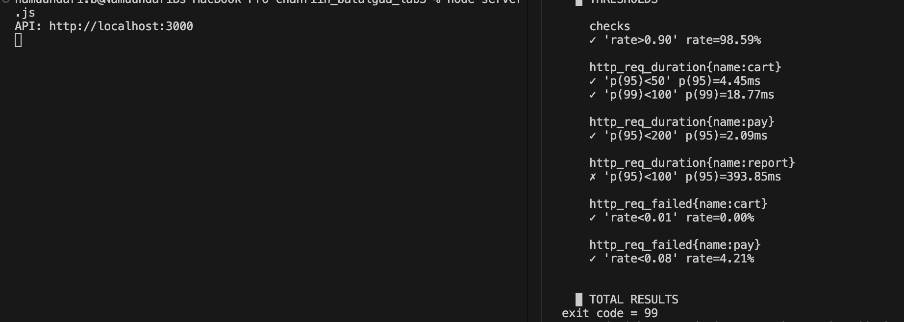

# Лаборатори №3: Чанарын сценарио → SLO → k6 threshold

## Оюутны мэдээлэл
- **Оюутны код:** B232270037
- **Оюутны нэр:** Б. Намуундарь

### Орчин

```
$ k6 version
k6 v2.2.0 (commit/devel, go1.26.5, darwin/arm64)

$ node --version
v20.20.0
```

---

## Алхам 1: Тестлэх локал API

```bash
npm init -y && npm install express
node server.js       # API: http://localhost:3000
```

`server.js` нь өөр өөр "зан төлөвтэй" гурван endpoint-той:

| Endpoint | Зан төлөв | Ямар чанарын шинжийг шалгах |
|---|---|---|
| `POST /cart/add` | Шууд хариулна (I/O байхгүй) | Performance |
| `GET /report` | 200–400 мс санамсаргүй саатал | Performance (удаан зам) |
| `POST /pay` | Хүсэлтийн ~5% нь HTTP 500 | Reliability |

---

## Алхам 2: Гурван сценарио бичих

Сценарио бүрийг Лекц 3-ын 6 хэсэгтэй формат (Тойм · Системийн төлөв · Орчны төлөв · Гадаад өдөөлт · Шаардлагатай хариу · Хэмжүүр)-аар бичив.

### Сценарио 1 — Performance (`POST /cart/add`)

| Хэсэг | Тайлбар |
|---|---|
| **Тойм** | Хэвийн ачааллын үед хэрэглэгч бараагаа сагсанд нэмэхэд систем хэр хурдан хариулж байгааг шалгана. |
| **Системийн төлөв** | Express API (`server.js`) 3000 порт дээр ажиллаж байна. Нэг инстанс, нэг процесс. Бүх 3 endpoint хэвийн, сүйрээгүй. |
| **Орчны төлөв** | Хэвийн ажлын цагийн ачаалал: **20 виртуал хэрэглэгч (VU) тогтмол**, давталт бүрийн хооронд 1 секунд бодох хугацаа хэмжилтийн цонх **1 минут** (хэмжсэнээр ≈930 хүсэлт — давталт бүр `/report`-ын ~290 мс хүлээлт агуулдаг тул 1.29 секунд үргэлжилнэ). Сүлжээ локал (localhost), CPU/санах ой 70%-иас доош ачаалалтай. |
| **Гадаад өдөөлт** | Хэрэглэгч "Сагсанд нэмэх" товч дарж, `POST /cart/add` хүсэлт илгээнэ (хэвийн хэрэглээний үйлдэл, эвдрэл биш). |
| **Шаардлагатай хариу** | Систем хүсэлтийг хүлээн авч, боловсруулж, `{ok: true, item: 1}` гэсэн HTTP 200 хариуг хэрэглэгчид буцаана. Хүсэлт алдаагүй, хүлээлгийн дараалалд гацахгүй. |
| **Хэмжүүр** | 1 минутын цонхонд: **p95 хариу хугацаа < 50 мс**, **p99 < 100 мс**, алдааны хувь **< 1%**. |

---

### Сценарио 2 — Reliability (`POST /pay`)

| Хэсэг | Тайлбар |
|---|---|
| **Тойм** | Хэвийн төлбөрийн үйлдлийн хэдэн хувь нь амжилтгүй болж байгааг (эвдрэлийн давтамж) хэмжинэ. |
| **Системийн төлөв** | API ажиллаж байгаа, сүлжээ тасраагүй. `/pay` endpoint нь дотоод төлбөрийн gateway-тэй холбогддог бөгөөд тухайн gateway тогтворгүй (хүсэлтийн ойролцоогоор 5% нь HTTP 500 `gateway timeout` буцаадаг). |
| **Орчны төлөв** | Хэвийн ажиллагааны горим. **20 VU тогтмол**, хэмжилтийн цонх **1 минут** (хэмжсэнээр ≈930 хүсэлт — статистик ач холбогдол бүхий түүвэр). |
| **Гадаад өдөөлт** | Хэрэглэгч "Төлөх" товч дарж `POST /pay` хүсэлт илгээнэ — **хэвийн хэрэглэгчийн зөв оролт**, санаатай алдаа эсвэл халдлага биш. |
| **Шаардлагатай хариу** | Систем төлбөрийг амжилттай боловсруулж `{paid: true}` бүхий HTTP 200 буцаана. Амжилтгүй тохиолдолд өгөгдөл гэмтээхгүйгээр (мөнгө хасагдахгүйгээр) HTTP 500 буцааж, алдааг логлоно. |
| **Хэмжүүр** | **POFOD (probability of failure on demand) < 0.08**, өөрөөр хэлбэл 930 хүсэлтэд амжилтгүй хүсэлт **74-өөс ихгүй**. Мөн амжилттай хариуны **p95 < 200 мс**. |

---

### Сценарио 3 — Availability (сервер гэнэт зогсоод дахин асах)

| Хэсэг | Тайлбар |
|---|---|
| **Тойм** | Сервер гэнэт унасан (crash) үед хэрэглэгчийн хүсэлтийн хэдэн хувь нь амжилтгүй болж, систем хэр хурдан сэргэхийг шалгана. |
| **Системийн төлөв** | Node.js процесс 3000 порт дээр хэвийн үйлчилгээ үзүүлж байна. Бодит орчинд процесс нь `pm2`/`systemd` зэрэг process manager-ын хяналтад байх ба унасан тохиолдолд автоматаар дахин асна; энэ лабораторид сэргээлтийг гараар гүйцэтгэнэ. |
| **Орчны төлөв** | **20 VU тогтмол** ачаалал гурван endpoint рүү зэрэг, давталт бүрийн хооронд 1 секунд бодох хугацаа. Хэмжилтийн цонх **2 минут**. Цонхны дунд **10 секундын зогсолт** зориудаар үүсгэнэ. |
| **Гадаад өдөөлт** | **ЭВДРЭЛ:** Node.js процесс гэнэт зогсоно (`Ctrl+C` — бодит орчинд санах ойн алдаа, `kill -9`, эсвэл серверийн unplanned restart). Энэ нь хэрэглэгчийн үйлдэл биш, системийн доторх эвдрэл. |
| **Шаардлагатай хариу** | Тасалдлын үед хүсэлт `connection refused`-ээр шууд унах ба өгөгдөл гэмтэхгүй. Процесс дахин ассаны дараа `/cart/add`, `/report`, `/pay` бүх endpoint нэмэлт оролцоогүйгээр хэвийн HTTP 200 буцаана. Эвдрэлийг мониторинг руу мэдэгдэнэ. |
| **Хэмжүүр** | 2 минутын цонхонд **хүсэлтийн амжилтын хувь ≥ 90%** (амжилттай хүсэлт / нийт хүсэлт), **сэргэх хугацаа (MTTR): p95 ≤ 15 секунд, p99 ≤ 25 секунд** — процесс зогссоноос эхлээд дахин асаж эхний амжилттай хариу буцаах хүртэл. |

---

### Сценарио 4 — Performance, удаан зам (`GET /report`)

| Хэсэг | Тайлбар |
|---|---|
| **Тойм** | Их хэмжээний өгөгдөл боловсруулдаг тайлангийн endpoint хэвийн ачаалалд хүлээгдсэн хугацаандаа багтаж байгааг шалгана. |
| **Системийн төлөв** | API 3000 порт дээр хэвийн ажиллаж байна. `/report` нь 20000 мөр буцаадаг бөгөөд боловсруулалтад 200–400 мс зарцуулдаг. |
| **Орчны төлөв** | **20 VU тогтмол**, давталт бүрийн хооронд 1 секунд бодох хугацаа, хэмжилтийн цонх **1 минут**. |
| **Гадаад өдөөлт** | Хэрэглэгч "Тайлан харах" товч дарж `GET /report` хүсэлт илгээнэ (хэвийн хэрэглээний үйлдэл). |
| **Шаардлагатай хариу** | Систем тайланг боловсруулж `{rows: 20000}` бүхий HTTP 200 хариу буцаана. Удаан боловсруулалт нь бусад endpoint-ийг блоклохгүй. |
| **Хэмжүүр** | 1 минутын цонхонд **p95 хариу хугацаа < 450 мс**. |

---

### Өөрийгөө шалгах: "Сайн сценариогийн 5 шинж"

| Шинж | Сценарио 1 (Performance) | Сценарио 2 (Reliability) | Сценарио 3 (Availability) |
|---|---|---|---|
| **Итгэмжтэй** (бодитоор биелэх боломжтой) | I/O хийдэггүй endpoint тул нэгж мс-д хариулдаг, 50 мс нь хангалттай нөөцтэй | Gateway-ийн бодит 5% алдаанд хэлбэлзлийн нөөц нэмсэн | Гараар дахин асаах нь 10 сек, 15 сек нөөцтэй |
| **Үнэ цэнэтэй** (бизнест ач холбогдолтой) | Сагс удаан бол хэрэглэгч худалдан авалтаа орхино | Төлбөр амжилтгүй бол шууд орлогын алдагдал | Систем унавал бүх борлуулалт зогсоно |
| **Ойлгомжтой** (хэмжих арга нь тодорхой) | k6 `http_req_duration` threshold | k6 `http_req_failed` rate | Health check log-оос uptime ба сэргэх хугацаа |
| **Тодорхой** (хэн, юуг, хаана) | Хэрэглэгч → `POST /cart/add` → API сервер | Хэрэглэгч → `POST /pay` → төлбөрийн gateway | Эвдрэл → Node процесс → бүх endpoint |
| **Нарийн** (тоон утгатай) | 20 VU, 1 мин, p95 < 50 мс, p99 < 100 мс | ≈930 хүсэлт, POFOD < 0.08 | 2 мин цонх, ≥ 90%, MTTR p95 ≤ 15 сек, p99 ≤ 25 сек |

---

## Алхам 3: Сценарио бүрээс SLO гаргах

### SLO хүснэгт

| Сценарио | SLI (юуг хэмжих) | Босго | Цонх / нөхцөл |
|---|---|---|---|
| **Performance** | `/cart/add` latency (`http_req_duration{name:cart}`) | **p95 < 50 мс**, p99 < 100 мс, алдаа < 1% | 20 VU тогтмол ачаалалд, 1 мин |
| **Reliability** | `/pay` error rate (`http_req_failed{name:pay}`) | **< 8%**, хариу хугацаа p95 < 200 мс | 1 мин, 20 VU |
| **Availability** | Бүх хүсэлтийн амжилтын хувь (`checks` rate) | **≥ 90%** | 2 мин, 10 сек зогсолт орсон |
| **Performance (удаан зам)** | `/report` latency (`http_req_duration{name:report}`) | **p95 < 450 мс** | 20 VU тогтмол ачаалалд, 1 мин |

### Яагаад яг эдгээр тоог сонгосон бэ

**Performance — p95 < 50 мс.**
`/cart/add` нь I/O үйлдэлгүй хөнгөн endpoint тул хэвийн үед маш хурдан ажиллах бөгөөд 50 мс-ийн босго нь бодит гүйцэтгэлийн доройтлыг эрт илрүүлэхэд тохиромжтой.

**Reliability — error rate < 8%.**
Серверт зориудаар 5% алдаа суулгасан тул 8%-ийн босго нь хэвийн санамсаргүй хэлбэлзлийг зөвшөөрөхийн зэрэгцээ алдааны түвшин мэдэгдэхүйц өсөхөд илрүүлэх боломжтой.

**Availability — амжилтын хувь ≥ 90%.**
2 минутын тестийн үед 10 секундийн тасалдал нь цагаар тооцоход 8.33% буюу 91.67% амжилт гэсэн үг тул 90% босго нь нэг богино эвдрэлийг тэсэх зорилгоор сонгогдсон.

**Performance  — p95 < 450 мс.**
`server.js` нь `/report`-д 200–400 мс санамсаргүй саатал үүсгэдэг тул онолын дээд p95 нь 390 мс; 450 мс-ийн босго нь энэ хэвийн тархалтыг багтаах ба зөвхөн дараалал үүсэх буюу боловсруулалт удаашрах тохиолдолд л давагдана.

> **Тоонуудын эх сурвалж:** Энэ хэсгийн **8.33%** ба **91.67%** нь цагаар тооцсон утга тул k6-ийн гаралтад байхгүй. **2.19%** нь `results/pass.txt`-ийн `checks_succeeded 97.81%`-аас гаргасан (100 − 97.81).

### Error budget (алдааны төсөв)

Availability SLO = **90%** → алдааны төсөв = **10%**.

**ЦАГААР тооцоход:**

```
Цонхны урт            = 2 минут     = 120 секунд
Алдааны төсөв (10%)   = 120 × 0.10  =  12 секунд
Төлөвлөсөн зогсолт    =             =  10 секунд
Үлдэгдэл төсөв        = 12 − 10     =   2 секунд   (төсвийн 83% зарцуулагдсан)
```

Өөрөөр хэлбэл 2 минутын цонхонд систем **12 секунд хүртэл унах "эрхтэй"**. 10 секунд зарцуулах төлөвлөгөөтэй тул цагаар тооцоход SLO давах ёстой, гэхдээ нөөц бараг үлдэхгүй.

SLI нь хугацаа биш хүсэлтийг хэмждэг тул сервер зогсоогүй үед ч /pay-ийн зориудаар суулгасан 5% алдаа нийт хүсэлтийн 1/3-д нөлөөлж, checks rate 97.81% болсон бөгөөд алдааны төсвийн нэг хэсэг аль хэдийн зарцуулагдсан байна.

```
Нийт төсөв                        = 10.00%  хүсэлтийн
/pay-ийн суурь алдаа              =  2.19%  ← 100 − 97.81 (pass.txt checks rate)
─────────────────────────────────────────
Зогсолтод үлдэх төсөв             =  7.81%  хүсэлтийн
```

10 секундын зогсолт нь 2 минутын цонхны 8.33%-ийг эзэлж, үлдсэн 7.81%-ийн алдааны төсвөөс давсан тул серверийн тасалдал нь зөвшөөрөгдөх хэмжээнээс хэтэрсэн гэж үзнэ.

## Алхам 4: SLO-гоо k6 threshold болгох

`slo-test.js` — endpoint бүрийг `name` tag-аар ялгаж, threshold-ыг tag тус бүрд тавьсан.

```bash
node server.js &
mkdir -p results && k6 run slo-test.js 2>&1 | tee results/pass.txt
```

### SLO → threshold харгалзаа

| SLO (Алхам 3) | `slo-test.js` доторх threshold |
|---|---|
| `/cart/add` p95 < 50 мс, p99 < 100 мс | `'http_req_duration{name:cart}': ['p(95)<50', 'p(99)<100']` |
| `/cart/add` алдаа < 1% | `'http_req_failed{name:cart}': ['rate<0.01']` |
| `/pay` error rate < 8% | `'http_req_failed{name:pay}': ['rate<0.08']` |
| `/pay` p95 < 200 мс | `'http_req_duration{name:pay}': ['p(95)<200']` |
| Амжилтын хувь ≥ 90% | `'checks': ['rate>0.90']` |
| `/report` p95 < 450 мс | `'http_req_duration{name:report}': ['p(95)<450']` |

### Үр дүн (`results/pass.txt`)

20 VU, 1 минут, 929 давталт, нийт **2787 хүсэлт**.

| SLI | Босго | Хэмжсэн утга | Үр дүн |
|---|---|---|---|
| `/cart/add` p95 | < 50 мс | **3.18 мс** | ✓ |
| `/cart/add` p99 | < 100 мс | **17.96 мс** | ✓ |
| `/cart/add` алдаа | < 1% | **0.00%** | ✓ |
| `/pay` error rate | < 8% | **6.56%** | ✓ |
| `/pay` p95 | < 200 мс | **1.53 мс** | ✓ |
| `/report` p95 | < 450 мс | **388.39 мс** | ✓ |
| `checks` rate | > 90% | **97.81%** (2726 / 2787) | ✓ |

**Exit code = 0** — бүх threshold давсан тул CI pipeline үргэлжлэх байсан.



*`sed -n '/THRESHOLDS/,/TOTAL RESULTS/p' results/pass.txt` — 7 threshold бүгд ✓.*

### Тэмдэглэл

**Босгыг 200 мс-ээс 50 мс болгосон нь зөв байсан.** Хэмжсэн p95 нь **3.18 мс** гарсан тул 200 мс-ийн босго нь бодит утгаас ~63 дахин сул буюу ямар ч доройтлыг илрүүлэхгүй "хоосон" шалгуур байх байсан.

**8% босго сонгосон нь энэ ажиллалтаар батлагдлаа.** `/pay`-ийн хэмжсэн error rate нь **6.56%** гарсан — суулгасан 5%-иас дээш. Хэрэв багшийн жишээг дагаж босгыг 5% дээр тавьсан бол энэ ажиллалт **зөв ажиллаж байгаа системийг буруугаар унагаах** байсан.

**`checks` rate 97.81% нь 100% биш.** Зогсолт огт байгаагүй ч `/pay`-ийн алдаа нийт check-ийн 1/3-д нөлөөлдөг. Энэ нь Алхам 5-д чухал: availability-ийн "суурь" түвшин 100% биш.

## Алхам 5: Мини chaos — availability сценариогоо бодитоор турших

### Хэрхэн туршив

```bash
node server.js                      # 1-р терминал
k6 run -d 2m slo-test.js 2>&1 | tee results/chaos.txt   # 2-р терминал
# t=45с үед 1-р терминал дээр Ctrl+C → 10 секунд хүлээв → node server.js дахин
```

`slo-test.js`-ийн default duration нь Алхам 4-ийн 1 минутын цонх тул availability-ийн 2 минутын цонхыг `-d 2m` тугаар дарж бичив. Ингэснээр нэг скрипт хоёр цонхонд ашиглагдаж, README-гийн босго кодтойгоо ижил хэвээр үлдэнэ.

### Threshold-ын үр дүн (`results/chaos.txt`)

| SLI | Босго | Хэмжсэн | Үр дүн |
|---|---|---|---|
| `checks` rate | > 90% | **87.89%** | ✗ **FAIL** |
| `/cart/add` алдаа | < 1% | **10.55%** | ✗ **FAIL** |
| `/pay` error rate | < 8% | **15.04%** | ✗ **FAIL** |
| `/cart/add` p95 | < 50 мс | 2.95 мс | ✓ |
| `/pay` p95 | < 200 мс | 1.73 мс | ✓ |
| `/report` p95 | < 450 мс | 392.74 мс | ✓ |

**Exit code = 99** — CI pipeline энэ алдааны кодоор build-ийг зогсооно.



*`checks`, `http_req_failed{name:cart}`, `http_req_failed{name:pay}` гурав ✗ — нэг эвдрэл гурван SLO зөрчсөн. Хугацааны threshold-ууд ✓ хэвээр.*

Анзаарах зүйл: **хугацааны threshold бүгд давсан**. Сервер унасан үед хүсэлт `connection refused`-ээр *шууд* буцдаг тул latency огт мууддаггүй — эвдрэл нь зөвхөн алдааны хувиар илэрнэ.

> **Тоонуудын эх сурвалж:** Доорх шинжилгээнд хоёр төрлийн тоо бий. **Хэмжсэн** — k6-ийн гаралтаас шууд (`5682`, `688`, `87.89%`, endpoint тус бүрийн `200 / 203 / 285`). **Тооцоолсон** — эдгээрээс арифметикаар гаргасан (`603`, `85`, `10.61%`, `1.50%`, MTTR `10.0` сек, зөвшөөрөгдөх зогсолт `8.0` сек). Тооцоолсон тоо бүрийн хажууд томьёог нь бичсэн тул `results/chaos.txt`-ээс мөрдөж шалгах боломжтой.

### Бодит availability — ХҮСЭЛТЭЭР тооцсон

```
Амжилттай хүсэлт / Нийт хүсэлт = 4994 / 5682 = 87.89%
```

Алдааны задаргаа:

| Эх үүсвэр | Хүсэлт | Нийтэд эзлэх хувь |
|---|---|---|
| Зогсолтын үеийн уналт (chaos.txt: cart 200 + report 203 + pay 200) | 603 | 603/5682 = 10.61% |
| `/pay`-ийн суурь 5% алдаа (chaos.txt: pay 285 − зогсолтын 200) | 85 | 85/5682 = 1.50% |
| **НИЙТ** | **688** | **12.10%** |

### Сэргэх хугацаа (MTTR)

`chaos.txt`-д зогсолтын үеийн уналтыг давталтаар тоолж MTTR-ийг гаргаж болно:

```
Зогсолтын үед унасан давталт    = 200        (chaos.txt: ✗ cart 200 / report 203 / pay 200)
Зогсолтын үеийн давталтын хурд  = 20.0 давт/с (20 VU ÷ 1.0 сек sleep)
Сэргэх хугацаа (MTTR)           = 200 / 20.0 = 10.0 секунд
```

**SLO: MTTR p95 ≤ 15 секунд → ✓ ДАВСАН.** Энэ нь гараар зогсоож дахин асаасан хугацаатай (10 секунд) таарч байгаа нь хэмжилтийн арга зөв болохыг батална. Анхаарах нь: **MTTR давсан ч availability унасан** — учир нь availability нь сэргэх хурднаас гадна эвдрэлийн үед хичнээн хүсэлт алдагдсанаас хамаардаг.

### Error budget-ээ хэтэрсэн үү?

**Тийм, 21%-иар хэтэрсэн.**

```
Алдааны төсөв (10% × 5682)  =  568 хүсэлт
Бодитоор унасан             =  688 хүсэлт
ХЭТЭРСЭН                    =  120 хүсэлт  (+21%)
```

### Яагаад цагаар ба хүсэлтээр тооцсон нь зөрөв?

| Тооцоолол | Утга |
|---|---|
| **Цагаар** (тооцоолсон, k6-д байхгүй) | 10с / 120с = 8.33% тасалдал → **91.67%** амжилт |
| **Хүсэлтээр** (k6-ийн `checks`) | 688 / 5682 = 12.10% уналт → **87.89%** амжилт |
| **Зөрүү** | **3.78 нэгж хувь** |

Хоёр шалтгаан:

**1. Зогсолтын секунд "тарган" байдаг.** Хэвийн үед давталт бүр `/report`-ын ~290 мс хүлээлт + 1 секунд sleep зарцуулдаг тул 1.29 секунд үргэлжилнэ. Сервер унасан үед `/report` шууд унах тул давталт 1.0 секунд болж богиносно:

```
Хэвийн үед    : 15.4 давталт/с
Зогсолтын үед : 20.0 давталт/с   ← 1.30 дахин олон
```

Тиймээс цонхны 8.33%-ийг эзлэх 10 секунд нь нийт хүсэлтийн **10.61%** (603/5682)-ийг идсэн.

**2. `/pay`-ийн суурь алдаа төсвөөс иддэг.** Эвдрэл болохоос үл хамааран `/pay` тасралтгүй 5% унадаг тул нэмэлт **1.50%** (85/5682) зарцуулагдсан. Цагаар тооцох аргад энэ огт харагддаггүй — сервер "ажиллаж байгаа" тул тэр хугацаа uptime-д тооцогддог.

### SLO хэт өөдрөг байсан уу, эсвэл 10с зогсолт хэт их байсан уу?

**Хоёулаа зэрэг.** Тоогоор шалгавал:

```
Зогсолтын үеийн хурд            = 60.3 хүсэлт/с
/pay-д зарцуулснаас үлдэх төсөв = 568 − 85 = 483 хүсэлт
Зөвшөөрөгдөх зогсолт            = 483 / 60.3 ≈ 8.0 секунд
```

Өөрөөр хэлбэл **90% SLO нь 8 секундын зогсолтыг л тэсэх чадвартай**, бидэнд 10 секунд байсан. Цагаар тооцоход 12 секунд болж харагдсан нь хоёр нөлөөг тооцоогүйнх. Засах хоёр зам бий: SLO-г бодитоор **87%** болгох, эсвэл сэргэх хугацааг **8 секундээс доош** байлгах (process manager-ээр автоматжуулбал 1–3 секунд болно).

### Reliability threshold мөн унасан — яагаад?

`http_req_failed{name:pay}` нь **15.04%** гарч 8%-ийн босгоо давсан. Гэтэл төлбөрийн gateway огт мууджаагүй — суурь алдаа 5% хэвээр байсан. Нэмэгдсэн 10% нь **бүхэлдээ зогсолтын үед унасан `/pay` хүсэлтүүд**. Мөн `/cart/add` нь 0%-аас 10.55% болж унасан.

Өөрөөр хэлбэл **нэг эвдрэл гурван SLO-г зэрэг зөрчсөн**. Энэ нь SLI-ийн загварчлалын алдаа: "хүсэлт амжилтгүй болсон" гэдгийг нэг дор тоолсон тул *үйлчилгээ байхгүй* (availability) ба *үйлчилгээ байгаа ч буруу хариулсан* (reliability) гэсэн хоёр өөр шалтгааныг ялгаагүй.

**Хэрхэн тусгаарлах вэ (нэг өгүүлбэр):** Reliability SLI-д зөвхөн *амьд серверийн буцаасан* HTTP 5xx хариуг тоолж (`res.status >= 500`), холболтын түвшний уналтыг (`res.status === 0`, өөрөөр хэлбэл `connection refused`) availability SLI-д хамааруулж тусад нь `Rate` метрикээр хэмжвэл нэг эвдрэл хоёр SLO-г зэрэг зөрчихгүй болно.

---

## Алхам 6: Threshold-оо зориуд эвдэх

`slo-test-fail.js` нь `slo-test.js`-ээс **ганцхан мөрөөр** ялгаатай:

```diff
- 'http_req_duration{name:report}': ['p(95)<450'],
+ 'http_req_duration{name:report}': ['p(95)<100'],
```

```bash
k6 run slo-test-fail.js 2>&1 | tee results/fail.txt
echo "exit=${PIPESTATUS[0]}"
```

### Үр дүн (`results/fail.txt`)

Threshold зөрчигдсөнийг дараах мөр харуулж байна:

```
    http_req_duration{name:report}
    ✗ 'p(95)<100' p(95)=393.85ms
```

Төгсгөлийн алдааны мөр:

```
level=error msg="thresholds on metrics 'http_req_duration{name:report}' have been crossed"
```



*Зөвхөн `/report` унасан, бусад 6 нь ✓ — босго нь серверийн 200 мс-ийн шалнаас доогуур учраас.*

| Threshold | Үр дүн |
|---|---|
| `http_req_duration{name:report}` p(95)<100 | ✗ **FAIL** — 393.85 мс |
| `http_req_duration{name:cart}` p(95)<50 | ✓ 4.45 мс |
| `http_req_duration{name:cart}` p(99)<100 | ✓ 18.77 мс |
| `http_req_duration{name:pay}` p(95)<200 | ✓ 2.09 мс |
| `http_req_failed{name:cart}` rate<0.01 | ✓ 0.00% |
| `http_req_failed{name:pay}` rate<0.08 | ✓ 4.21% |
| `checks` rate>0.90 | ✓ 98.59% |

### Exit code

| Ажиллалт | Exit code |
|---|---|
| `results/pass.txt` (бүх threshold давсан) | **0** |
| `results/chaos.txt` (availability унасан) | **99** |
| `results/fail.txt` (зориуд эвдсэн) | **99** |

0 = тест амжилттай, 99 = threshold зөрчигдсөн. Иймээс k6 threshold нь CI pipeline-д шууд gate болж, threshold унасан тохиолдолд build-ийг зогсоох боломжтой.

### Яагаад `/report` унаж, `/cart/add` давсан вэ?

Хоёр endpoint-ийн гүйцэтгэлийн үндсэн нөхцөл өөр байна:

| | `/report` | `/cart/add` |
|---|---|---|
| Кодод юу байгаа | `sleep(200 + random × 200)` | Зөвхөн `res.json(...)` |
| Хугацааны **шал** | **200 мс** (кодоор баталгаажсан) | ~0 мс |
| Бодит p95 | 393.85 мс | 4.45 мс |
| Босго | 100 мс | 50 мс |

/report endpoint нь кодын хувьд дор хаяж 200 мс сааталтай тул p95-ийн 100 мс threshold-ийг хангах боломжгүй бөгөөд зориудаар FAIL болсон.

Харин /cart/add нь зохиомол сааталгүй, localhost дээр 4.45 мс p95 үзүүлсэн тул 50 мс-ийн threshold-ийг хангаж PASS болсон. Өөрөөр хэлбэл threshold-ийн зөв эсэхийг зөвхөн тооны хэмжээгээр бус, системийн бодит гүйцэтгэлийн хязгаартай харьцуулж тодорхойлно.

## Тэмдэглэл: Exit code-ийг зөв авах

Дараах команд threshold унасан ч 0 буцааж болзошгүй:

```bash
k6 run slo-test-fail.js | tee results/fail.txt; echo "exit=$?"   # ← буруу
```

Учир нь $? нь pipeline-ийн сүүлчийн команд болох tee-ийн exit code-ийг авдаг.
k6-ийн exit code-ийг авахын тулд:
```bash
k6 run slo-test-fail.js | tee results/fail.txt; echo "exit=${PIPESTATUS[0]}"   # ← зөв
```
Энэ лабораторид pipeline-ийн exit code-ийг буруу уншсанаас threshold унасан ажиллалтыг эхэндээ 0 гэж тэмдэглэсэн. CI pipeline-д ийм алдаа гарвал тест FAIL болсон ч build амжилттай мэт харагдах эрсдэлтэй.
---

## Дүгнэлт

Сценариог үгээр тодорхойлохоос илүү түүнийг хэмжих боломжтой SLO болон бодит threshold болгон хөрвүүлэх нь хамгийн хэцүү хэсэг байлаа. Ялангуяа системийн бодит гүйцэтгэлд тохирсон босгыг сонгохын тулд эхлээд тест ажиллуулж, бодит хэмжилттэй харьцуулах шаардлагатай болсон. 
Жишээлбэл, /cart/add endpoint-ийн бодит p95 3.18 мс байсан тул эхний 200 мс-ийн босгыг 50 мс болгон нарийвчилсан. Мөн /report-ын threshold-ийг кодын хамгийн бага 200 мс хүлээлтээс доогуур 100 мс болгосноор threshold зориудаар FAIL болж байгааг баталгаажуулсан. 
Тооцоолсон хүсэлтийн тоо болон бодит хэмжилт мөн зөрж, 1200 гэж тооцсон боловч бодитоор 929 хүсэлт гарсан нь системийн бодит зан төлөвийг хэмжихийн ач холбогдлыг харуулсан. 
Chaos туршилтаар 10 секундын зогсолтыг хугацаагаар тооцсон 91.67%-ийн availability биш, бодит checks rate 87.89% гарсан тул availability сценариогийн анхны хэмжүүрийг үгүйсгэсэн. 
Үүнд сервер зогсох үед хүсэлтийн хурд өөрчлөгдөх болон /pay-ийн суулгасан 5%-ийн алдаа зэрэг хүчин зүйлс нөлөөлсөн. Харин MTTR 10 секунд гарч, 15 секундын SLO-г хангасан тул сэргэлтийн хугацааны хэсэг батлагдсан. 
Иймээс chaos туршилт нь availability-г зөвхөн хугацаагаар бус, бодит хүсэлтэд суурилсан SLI-ээр хэмжих шаардлагатайг харуулсан.